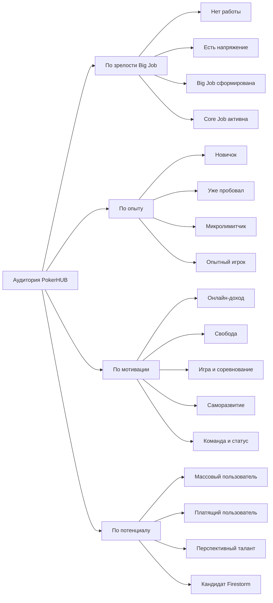

# PokerHUB_итоговый_документ

## 1. Краткое резюме

**PokerHUB должен быть не просто обучающей платформой и не только воронкой на контракт Firestorm, а системой диагностики, маршрутизации, обучения, практики, монетизации и отбора игроков**.

Ключевая Big Job клиента:

> Когда я чувствую, что текущая работа, доход или образ жизни меня не устраивают, я хочу проверить покер как интеллектуальный путь к свободе, деньгам, статусу и профессиональной среде, чтобы понять, могу ли я изменить свою траекторию (жизнь) через игру.

Основная продуктовая логика:

```text
Трафик
→ формирование / активация Big Job
→ диагностика
→ сегментация
→ бесплатный маршрут
→ безопасная практика / CPA
→ AI-бот саппорт и кураторство
→ комьюнити
→ платные tripwire сервисы и услуги
→ повторная диагностика
→ sales маршрут
→ talent маршрут
→ PokerHUB Academy
→ Firestorm Review
→ Firestorm контракт
→ платные сервисы и услуги на Firestorm контракте
```

Важно: **платные продукты не должны ломать бесплатную воронку**. Они должны быть не шлагбаумом, а ускорителями для талантов, и альтернативой для остальных, кто не прошел отбор. Если человек не покупает, он остаётся в бесплатном маршруте, продолжает получать пользу, дозревает и может быть повторно активирован.

## 2. Цель и Контекст

### 2.1. Цель документа

Собрать в единую структуру ключевые выводы из обсуждения по PokerHUB:

- общую стратегическую логику проекта;
- сегменты аудитории;
- JTBD / AJTBD-работы;
- Big Job, Core Jobs, Small Jobs;
- продуктовую воронку;
- логику монетизации;
- роль диагностики;
- роль бесплатного маршрута;
- роль CPA-аффилейтки;
- роль AI-бота;
- путь к PokerHUB Academy и Firestorm;
- риски, пробелы и дальнейшие действия.

### 2.2. Контекст проекта

PokerHUB - продуктовая экосистема, которая должна:

- привлекать аудиторию, интересующуюся покером;
- сегментировать пользователей по мотивации, опыту, риску и потенциалу;
- давать бесплатный маршрут входа;
- монетизировать аудиторию через CPA, сервисы и услуги, подписки, разборы, тренировки, платные продукты;
- отбирать перспективных игроков в Pokerhub Academy;
- передавать лучших кандидатов в Firestorm.

PokerHUB платформа, которая агрегирует обучение, курсы, тренажёры и сервисы для начинающих и действующих игроков, чтобы сделать путь в покер доступным и понятным. Бизнес-модель через аффилейт, платные курсы, подписки, передаче на контракт в Firestorm и партнёрства.

---

## 3. Главные смыслы, идеи, гипотезы и выводы

### 3.1. Факты

- PokerHUB работает в связке с Firestorm.
- Firestorm — конечная профессиональная среда / команда для лучших игроков.
- PokerHUB не должен быть только воронкой в контракт с FireStorm.
- PokerHUB должен монетизировать широкую аудиторию, а не только будущих контрактников.
- Контракт Firestorm нельзя продавать как покупаемый продукт.
- Контракт Firestorm — это результат отбора, готовности, дисциплины и соответствия критериям.
- Воронка должна включать диагностику, сегментацию, обучение, практику, фидбек, платные усилители, PokerHUB Academy и Firestorm Review.
- CPA-аффилейтку нужно встроить продуктово раньше, как часть безопасного старта в реальном руме.
- Платные продукты не должны вредить бесплатной воронке, а должны усилять её. Это не означает, что нужно бояться продавать.
- Диагностика и сегментация очень важный этап.
- AI-бот должен быть частью бесплатного маршрута, но может иметь платное расширение.
> Уточнить! Success Manager / куратор важен для удержания, мотивации и доведения пользователя по маршруту.


### 3.2. Интерпретации
- PokerHUB должен стать **системой ориентации и маршрутизации в покере**, а не просто LMS.
- Главная ценность верхней воронки — не курс, а ответ на вопрос: где я нахожусь в покере сейчас, и как мне перейти в точку B?
- Бесплатная часть должна не только обучать, но и формировать доверие, снижать тревогу, объяснять риски и давать первый результат.
- CPA нужно встроить не как рекламный блок, а как продуктовую работу: **“безопасно начать практику в руме”**.
- Платные продукты должны усиливать разные маршруты:
  - подписка — регулярность и комьюнити;
  - AI Pro — больше разборов и персонализация;
  - индивидуальный разбор — ясность по ошибкам;
  - ИПР — персональный план;
  - тренировки — ускорение роста;
  - core-продукты — системное обучение;
  - PokerHUB Academy — путь для талантов.

  ### 3.3. Гипотезы

- У части аудитории Big Job уже сформирована: они хотят проверить покер как путь к свободе, деньгам, статусу и профессиональной среде.
- У другой части аудитории Big Job ещё не сформулирована, но есть “сырьё” для неё: неудовлетворённость работой, доходом, образом жизни, желание свободы, интерес к играм, аналитике, риску и соревнованию.
- PokerHUB может работать не только с теми, кто уже сформулировал Big Job, но и с теми, у кого есть latent job — скрытое напряжение, которое можно честно связать с покером.
- Диагностика может быть главным продуктовым механизмом, который превращает размытый интерес в осознанный маршрут.
- Ранний "CPA Safe Room Start", когда мы под услугой помощи старта в покере продвигаем свою CPA сделку, может стать не просто источником дохода, а важной частью критической последовательности работ.
- AI-бот может снижать налоговые работы: ожидание ответа, страх задать вопрос, потерю мотивации, отсутствие понимания следующего шага.
- Группа по подписке и циклические работы, такие как разбор базы или HH, или ежемесячные тренировки, могут стать базой recurring-монетизации.

---

## 4. Карта сущностей

| Сущность | Тип | Роль в системе |
|---|---|---|
| PokerHUB | Продуктовая экосистема | Привлекает, диагностирует, обучает, монетизирует и маршрутизирует игроков |
| Firestorm | Команда / фонд | Принимает лучших игроков после отбора и review |
| PokerHUB Academy | Промежуточный трек | Готовит и квалифицирует кандидатов перед Firestorm |
| Пользователь / клиент | B2C-аудитория | Проходит путь от интереса к покеру до практики, монетизации или отбора |
| Новичок | Сегмент | Хочет безопасно разобраться и не чувствовать себя беспомощным |
| Ищущий онлайн-доход | Сегмент | Хочет проверить покер как путь к свободе и деньгам |
| Геймер | Сегмент | Хочет монетизировать соревновательное мышление |
| Уже проигрывавший | Сегмент | Хочет понять ошибки и перестать сливать |
| Микролимитный игрок | Сегмент | Хочет найти лики и выйти из стагнации |
| Потенциальный талант | Сегмент | Хочет проверить путь к PokerHUB Academy / Firestorm |
| > Уточнить! Success Manager | Роль | Помогает не теряться, не выгорать, проходить маршрут и доходить до следующих шагов |
| AI-бот куратор | Продукт / процесс | Помогает в free route, отвечает на вопросы, даёт разборы, напоминает, маршрутизирует |
| CPA Safe Room Start | Продуктовый блок | Помогает безопасно начать практику в руме и монетизирует через аффилейт |
| Группа по подписке | Платный продукт | Создаёт регулярность, поддержку, комьюнити и MRR |
| Индивидуальный разбор | Платный продукт | Помогает понять ошибки конкретного игрока |
| ИПР | Продуктовый результат | Индивидуальный план развития игрока |
| Групповые тренировки | Платный продукт | Масштабируемая обратная связь и обучение |
| Индивидуальные тренировки | Платный продукт | Персональное ускорение роста |
| Core-продукты | Образовательные продукты | Spin / MTT / Cash / Anti-Fish / Discipline Trial |
| Firestorm Review | Процесс отбора | Объективная оценка кандидата перед контрактом |
| Контракт | Финальный outcome talent route | Не продаётся напрямую, а достигается через отбор |

---

## 5. Сегментация аудитории

### 5.1. Сегментация по уровню зрелости Big Job

| Уровень | Состояние пользователя | Статус для PokerHUB | Правильное действие |
|---|---|---|---|
| Уровень 0 | Нет выраженной работы, просто потребляет контент | Медиа-аудитория | Вовлекать, развлекать, удерживать, дешево ретаргетить |
| Уровень 1 | Есть напряжение, но нет связи с покером | Потенциальный клиент | Формировать рамку, объяснять покер как проверяемый путь |
| Уровень 2 | Big Job сформирована | Целевой клиент верхней воронки | Вести в диагностику и бесплатный маршрут |
| Уровень 3 | Core Job активна | Горячий пользователь | Вести в практику, фидбек, платные усилители |
| Уровень 4 | Есть потенциал и дисциплина | Talent lead | Вести в Academy Scoring и Pre-Firestorm Track |

### 5.2. Сегментация по JTBD

| Сегмент | Основная работа | Что ищет |
|---|---|---|
| Нулевой новичок | Понять, могу ли я вообще войти в покер | Простую базу, поддержку, отсутствие стыда |
| Ищущий онлайн-доход | Проверить покер как путь к свободе и деньгам | Реалистичный маршрут, риски, безопасность |
| Геймер | Перенести соревновательный навык в покер | Динамику, челлендж, измеримый прогресс |
| Уже проигрывавший | Понять, почему сливаю | Диагностику ошибок, Anti-Fish, ИПР |
| Микролимитный игрок | Найти лики и выйти из стагнации | Разборы, тренировки, план роста |
| Потенциальный талант | Проверить готовность к профессиональному пути | Скоринг, критерии, Academy, review |
| Саморазвивающийся | Использовать покер как тренажёр мышления | Аналитика, риск-менеджмент, дисциплина |
| Профессионал | Оставаться конкурентоспособным | Продвинутые инструменты, AI, тренировки |
| Тренер / фонд / B2B | Готовить игроков быстрее и дешевле | Дашборды, автоматизация, white-label |

---

## 6. Jobs-to-be-Done

### 6.1. Главная Big Job

> Когда я чувствую, что текущая работа, доход или образ жизни меня не устраивают, я хочу проверить покер как интеллектуальный путь к свободе, деньгам, статусу и профессиональной среде, чтобы понять, могу ли я изменить свою траекторию через игру.

### 6.2. Core Jobs

| Core Job | Контекст возникновения | Мотивация | Желаемый результат | Барьеры | Критерии успеха |
|---|---|---|---|---|---|
| Понять, подходит ли мне покер | Человек заинтересовался покером, но не уверен | Не тратить ресурсы впустую | Получить первичный ответ и маршрут | Скепсис, страх лудки, непонимание | Завершил диагностику, получил сегмент |
| Понять стартовый уровень | Нет ясности, новичок он или уже готов к практике | Получить точку А | Понять свой уровень и ограничения | Стыд, переоценка себя | Получил честную оценку |
| Понять реальные риски | Покер кажется путём к деньгам | Не попасть в иллюзию быстрых денег | Понять банкролл, дистанцию, дисперсию | Азарт, завышенные ожидания | Принял realistic expectations |
| Освоить базу | Интерес есть, знаний мало | Не чувствовать себя беспомощным | Понять правила и механику | Сложность, термины | Прошёл первые уроки и задания |
| Начать безопасную практику | Готовность к реальным играм | Получить опыт без разрушения банкролла | Рум, лимиты, депозит, план | Страх слива, недоверие | Зарегистрировался и начал по плану |
| Получить обратную связь | Сделаны первые решения | Понять ошибки | Фидбек по игре | Нет тренера, стыд вопросов | Получил 1–3 главных лика |
| Выбрать дисциплину | Нужно решить, Spin / MTT / Cash | Начать с подходящего формата | Получить recommendation по fit | Хайп, чужие советы | Выбран стартовый маршрут |
| Видеть прогресс | Пользователь обучается и играет | Сохранять мотивацию | Понимать движение | Нет метрик, дисперсия | Есть прогресс-отчёт |
| Получать поддержку | Пользователь застрял | Не выпасть | Получить помощь и следующий шаг | Стыд, прокрастинация | Вернулся в маршрут |
| Выбрать следующий шаг | База или практика пройдены | Не остановиться | LTV route / training / Academy / return later | Неясность | Получил next best action |
| Проверить подхожу ли я для команды | Есть дисциплина и интерес к росту | Понять шансы | Academy Scoring | Страх оценки | Получил score и критерии |
| Доказать готовность к Firestorm | Есть амбиция на контракт | Попасть в профессиональную среду | Review и возможный контракт | Неясные критерии, страх ответственности | Выполнены требования и пройден review |

### 6.3. Small Jobs

- Когда я впервые вижу контент о покере, я хочу понять, почему покер может быть связан со свободой, деньгами, статусом и профессиональной средой, чтобы решить, стоит ли изучать тему дальше.
- Когда я попадаю в Telegram-канал, бот или лендинг, я хочу быстро понять, что это за проект и для кого он, чтобы решить, доверять ли ему.
- Когда я вижу обещание покера как пути, я хочу понять, где здесь правда, а где иллюзия, чтобы не попасть в мутную схему.
- Когда я сомневаюсь, подходит ли мне покер, я хочу пройти диагностику, чтобы получить первичный ответ про свой потенциал.
- Когда я прохожу диагностику, я хочу ответить на вопросы про опыт, цели, время, риск, банкролл и мотивацию, чтобы система правильно определила мой маршрут.
- Когда я получаю результат диагностики, я хочу увидеть понятный тип пользователя и следующий шаг, чтобы не думать самому, с чего начать.
- Когда я почти не знаю правил, я хочу понять комбинации, позиции, термины и базовую механику игры, чтобы перестать чувствовать себя беспомощным.
- Когда я прохожу первый урок, я хочу получить простое задание, чтобы сразу почувствовать движение вперёд.
- Когда я не понимаю материал, я хочу быстро задать вопрос и получить ответ, чтобы не застрять.
- Когда я думаю о реальной игре, я хочу понять риски, дисперсию, банкролл и дистанцию, чтобы не ожидать быстрых денег.
- Когда я выбираю дисциплину, я хочу сравнить Spin, MTT и Cash по времени, дисперсии, сложности, динамике и перспективам, чтобы выбрать подходящий старт.
- Когда я выбираю первый формат, я хочу понять, почему мне стоит начать именно с него, чтобы не сомневаться в маршруте.
- Когда я готов к первому руму, я хочу понять, где играть, как зарегистрироваться, какие бонусы использовать и с каких лимитов начинать.
- Когда я вношу первый депозит, я хочу понимать, сколько можно безопасно выделить, чтобы не нарушить банкролл-план.
- Когда я играю первые раздачи или турниры, я хочу фиксировать непонятные решения, чтобы потом разобрать ошибки.
- Когда я проигрываю первые деньги, я хочу понять, это ошибка, дисперсия или неправильный подход, чтобы не сделать ложный вывод о себе.
- Когда я получаю первый фидбек, я хочу увидеть 1–3 главные ошибки, чтобы сфокусироваться на самом важном.
- Когда я понимаю свои ошибки, я хочу получить план исправления, чтобы не тонуть в бесконечной теории.
- Когда я тренируюсь, я хочу регулярно повторять ключевые споты, чтобы закреплять правильные решения.
- Когда я прохожу курс или маршрут, я хочу видеть прогресс, чтобы понимать, что я реально двигаюсь.
- Когда я пропускаю занятия или выпадаю, я хочу получить мягкое напоминание, чтобы вернуться без стыда и давления.
- Когда я теряю мотивацию, я хочу увидеть связь текущего шага с большой целью, чтобы вспомнить, зачем я начал.
- Когда я хочу больше регулярности, я хочу попасть в группу или комьюнити, чтобы не идти одному.
- Когда мне нужна персональная ясность, я хочу получить индивидуальный разбор и ИПР, чтобы понять, что именно мне делать дальше.
- Когда я хочу быстрее расти, я хочу получить групповые или индивидуальные тренировки, чтобы получать обратную связь от более сильных игроков.
- Когда я завершил базовый этап, я хочу пройти повторную диагностику, чтобы понять, изменился ли мой уровень и маршрут.
- Когда я показываю дисциплину, активность и обучаемость, я хочу понять, есть ли у меня потенциал для Academy, чтобы не гадать самому.
- Когда я претендую на профессиональный путь, я хочу понимать критерии отбора, чтобы знать, что именно нужно доказать.
- Когда я прохожу квалификацию, я хочу выполнять объём, отчёты, тесты и задания, чтобы подтвердить готовность не словами, а действиями.
- Когда я готов к review, я хочу получить карточку кандидата, чтобы команда могла объективно оценить мой прогресс.
- Когда я получаю предложение контракта, я хочу понять условия, обязанности, риски и выгоды, чтобы принять осознанное решение.
- Когда я подписываю контракт, я хочу пройти онбординг в команду, чтобы встроиться в систему и начать профессиональный путь.

**продукты и операционные задачи команды должны выводиться из JTBD-карты клиента**, а не существовать отдельно.
---

## 8. Pain Points, Needs, Triggers, Objections, Risks, Opportunities

### 8.1. Pain Points

| Pain Point | Где проявляется |
|---|---|
| Человек не понимает, подходит ли ему покер | До диагностики |
| Покер кажется лудкой или мутной схемой | Верхняя воронка |
| Слишком много хаотичной информации | YouTube, форумы |
| Новичок стыдится задавать вопросы | Free route |
| Нет понятного первого шага | Онбординг |
| Страх слить банкролл | Перед практикой |
| Непонятно, какую дисциплину выбрать | Перед стартом |
| Нет фидбека по ошибкам | После первых игр |
| Дисперсия ломает мотивацию | Практика |
| Пользователь выпадает из курса | Retention |
| Неясно, зачем платить | Переход к paid |
| Контракт воспринимается как продажный outcome | Talent route |
| Не хватает методологии курса | Core-продукты |
| Команда распыляется на слишком много задач | Операционная часть |

### 8.2. Needs

- Понять, стоит ли вообще входить в покер.
- Получить безопасную рамку старта.
- Получить маршрут.
- Понять риски.
- Освоить базу без перегруза.
- Получать быстрые ответы.
- Начать практику без хаоса.
- Видеть прогресс.
- Иметь поддержку.
- Получить план исправления ошибок.
- Понять путь в Academy / Firestorm.
- Не потерять бесплатный маршрут при отказе от покупки.

### 8.3. Triggers

- Недовольство текущей работой.
- Недовольство доходом.
- Желание свободы.
- Интерес к играм и соревнованию.
- Интерес к удалённому заработку.
- Опыт проигрыша в покере.
- Интерес к аналитике, риску и решениям.
- Контент про путь игрока.
- История успеха.
- Желание проверить себя.
- Попадание в Telegram-канал / бот.
- Фриролл, челлендж, тест, квиз.

### 8.4. Objections

| Возражение | Возможная реальная причина |
|---|---|
| “Покер — это лудка” | Страх социальной оценки и потери контроля |
| “Я солью деньги” | Страх риска и отсутствия системы |
| “Я не потяну” | Низкая уверенность |
| “Нет времени” | Нет связи между текущим шагом и Big Job |
| “Дорого” | Неясна ценность или нет доверия |
| “YouTube бесплатный” | Не понята ценность маршрута и фидбека |
| “Я сам разберусь” | Страх покупки или оценки |
| “Я хочу сразу в команду” | Желание статуса без понимания критериев |
| “Мне нужен только GTO-софт” | Желание контроля и серьёзности |

### 8.5. Risks

- Слишком ранняя продажа платных продуктов.
- Платные продукты могут повредить бесплатной воронке.
- CPA может восприниматься как реклама рума, если не упаковать его как safe start.
- Слишком много продуктов может размыть фокус.
- Низкое качество курса может убить retention.
- AI-бот может создать завышенные ожидания, если не ограничить его роль.
- Контракт Firestorm может быть неправильно воспринят как обещание.
- Верхняя аудитория может быть слишком холодной и без настоящей работы.
- Big Job может быть слабо сформирована.
- Не хватает данных по сегментам, платежеспособности и LTV.

### 8.6. Opportunities

- Сделать диагностику главным продуктом верхней воронки.
- Встроить CPA как часть безопасной практики.
- Использовать AI-бота как бесплатного куратора и entry point в paid.
- Сделать подписку вокруг циклических работ: тренировки, разборы, отчёты, челленджи.
- Использовать виральные механики: share score, лидерборды, фрироллы, челленджи.
- Построить Return Later route для тех, кто не готов.
- Развести LTV route и Talent route.
- Использовать Success Manager для удержания, сегментации и роста LTV.
- Создать прозрачный Academy Scoring.
- Перепаковать путь к Firestorm как результат объективного отбора, а не продажу мечты.

---

## 9. Логика процессов и последовательность действий

### 9.1. Основной пользовательский процесс

```text
1. Человек видит контент / рекламу / пост / посев.
2. У него активируется интерес или существующее напряжение.
3. Он попадает в Telegram / бот / лендинг.
4. Проходит диагностику.
5. Получает сегмент и маршрут.
6. Начинает бесплатный маршрут на интенсиве.
7. Получает помощь AI-бота.
8. Осваивает базу.
9. Переходит к безопасной практике.
10. Регистрируется в руме через CPA.
11. Получает первый фидбек.
12. Получает оффер платного усилителя.
13. Если не покупает — остаётся в free route.
14. Если покупает — ускоряется через подписку, разбор, ИПР, тренировки или core-продукт.
15. Проходит повторную диагностику.
16. Подходящие кандидаты идут в PokerHUB Academy.
17. После квалификации — Firestorm Review.
18. После одобрения — контракт и онбординг.
```

## 10. Таблицы ключевой информации

### 10.1. Продуктовая лестница

| Уровень | Продукт / механизм | Роль |
|---|---|---|
| Free | Покерный компас | Диагностика и сегментация |
| Free | Интенсив | Диагностика и сегментация |
| Free | Мини-курс | Первая польза и база |
| Free | AI-бот куратор | Поддержка, ответы, маршрутизация |
| Free | 10 задач / тренажёр | Первое действие |
| Free / affiliate | CPA Safe Room Start | Безопасная практика и ранняя монетизация |
| Tripwire | Безопасный старт / 100 решений | Первая покупка |
| Subscription | Группа по подписке | Регулярность, MRR, комьюнити |
| Subscription | AI Pro | Больше разборов и персонализации |
| Paid diagnostic | Индивидуальный разбор + ИПР | Персональный план |
| Training | Групповые тренировки | Масштабируемый фидбек |
| Training | Индивидуальные тренировки | Персональный рост |
| Core | Spin / MTT / Cash / Anti-Fish | Системное обучение |
| High-ticket | Bootcamp / Academy Product | Глубокое сопровождение |
| Talent | Academy Scoring | Отбор |
| Talent | PokerHUB Academy | Подготовка кандидата |
| Talent | Firestorm Review | Финальная оценка |
| Outcome | Контракт Firestorm | Профессиональный путь для лучших |

### 10.2. Разделение маршрутов после повторной диагностики

| Маршрут | Для кого | Следующий шаг |
|---|---|---|
| LTV route | Массовый пользователь | Подписка, AI, комьюнити, CPA |
| Training route | Пользователь с запросом на рост | Разбор, ИПР, групповые / индивидуальные тренировки |
| High-ticket route | Мотивированный пользователь с бюджетом | Bootcamp / Academy Product |
| Talent route | Дисциплинированный и перспективный игрок | Academy Scoring |
| Return Later | Не готов сейчас | План доработки, контент, повторная диагностика |

### 10.3. Критическая последовательность работ

| Этап | Работа клиента | Что должно произойти |
|---|---|---|
| 1 | Осознать интерес / напряжение | Контент попадает в контекст |
| 2 | Понять, подходит ли покер | Диагностика |
| 3 | Получить маршрут | Сегментация |
| 4 | Освоить базу | Free route |
| 5 | Снизить страх практики | Риски, банкролл, safe start |
| 6 | Начать первые действия | Тренажёр / рум |
| 7 | Получить фидбек | AI / разбор / куратор |
| 8 | Исправить ошибки | ИПР / тренировки |
| 9 | Продолжить системно | Подписка / core |
| 10 | Пройти повторную диагностику | Next best action |
| 11 | Выбрать LTV или Talent route | Разведение маршрутов |
| 12 | Для талантов — пройти review | Academy / Firestorm |

---

## 11. Mermaid-диаграммы

### 11.1. Дерево ключевых смыслов

```mermaid
flowchart TB
    PH((PokerHUB))

    PH --> SM["Смысл"]
    SM --> SM1["Проверить покер как путь"]
    SM --> SM2["Дать безопасный вход"]
    SM --> SM3["Снизить хаос"]
    SM --> SM4["Дать маршрут"]
    SM --> SM5["Монетизировать аудиторию"]
    SM --> SM6["Отобрать таланты"]

    PH --> BJ["Big Job"]
    BJ --> BJ1["Текущая работа, доход или образ жизни не устраивают"]
    BJ --> BJ2["Проверить покер как путь к свободе, деньгам, статусу и среде"]
    BJ --> BJ3["Понять, могу ли изменить траекторию через игру"]

    PH --> CR["Core"]
    CR --> CR1["Диагностика"]
    CR --> CR2["Сегментация"]
    CR --> CR3["База"]
    CR --> CR4["Практика"]
    CR --> CR5["Фидбек"]
    CR --> CR6["Прогресс"]
    CR --> CR7["Next step"]

    PH --> PR["Продукты"]
    PR --> PR1["Покерный компас"]
    PR --> PR2["Мини-курс"]
    PR --> PR3["AI-бот"]
    PR --> PR4["CPA Safe Start"]
    PR --> PR5["Подписка"]
    PR --> PR6["Разборы"]
    PR --> PR7["Тренировки"]
    PR --> PR8["Core-курсы"]
    PR --> PR9["Academy"]
    PR --> PR10["Firestorm Review"]

    PH --> PC["Принципы"]
    PC --> PC1["Платное не ломает бесплатное"]
    PC --> PC2["CPA встроен рано"]
    PC --> PC3["Диагностика важнее продажи"]
    PC --> PC4["Контракт нельзя купить"]
    PC --> PC5["Firestorm только для лучших"]
```



### 11.2. Диаграмма сегментации



---

## 12. Противоречия и напряжения

### 12.1. Контракт vs монетизация широкой аудитории

Раньше фокус был на доведение пользователя до контракта Firestorm при CAC до $300. Сейчас цель изменилась: PokerHUB должен монетизировать почти каждого, а в Firestorm передавать только лучших.

**Вывод:** контракт остаётся важным outcome, но не должен быть единственной North Star для всей системы.

### 12.2. Бесплатная воронка vs платные продукты

Есть риск, что ранняя продажа платных продуктов снизит прохождение бесплатного маршрута.

**Вывод:** платные продукты должны быть side-offer / accelerator, а не gate.

### 12.3. CPA как монетизация vs CPA как забота

CPA может восприниматься как рекламная интеграция и вызывать недоверие.

**Вывод:** CPA нужно упаковывать как безопасный старт в руме, а не как “зарегистрируйся по нашей ссылке”.

### 12.4. Big Job есть не у всех

Не каждый пользователь уже сформулировал для себя Big Job.

**Вывод:** часть аудитории — это не готовый спрос, а зона формирования спроса. С ней нужно работать через контент, сравнения, диагностику и ориентацию.

### 12.5. Покер как путь к свободе vs дициплина и ответственность

Покер может быть связан с деньгами и свободой, но также связан с рисками, дисперсией и гемблинг-контекстом.

**Вывод:** коммуникация должна объяснять путь и смыслы, а не обещанить легкие деньги и успех для всех.

---

## 13. Что важно не потерять

- Главная Big Job должна оставаться одной, а не распадаться на случайный список.
- Диагностика — ядро воронки, а не просто квиз.
- Сегментация должна быть по работам, мотивации, готовности платить, опыту, риску и потенциалу.
- Бесплатная воронка должна продолжаться даже после отказа от покупки.
- Платные продукты — ускорители, а не шлагбаумы.
- CPA нужно встроить раньше, как безопасный старт практики.
- AI-бот — часть бесплатного маршрута и мост в платные продукты.
- > Уточнить! Success Manager нужен для снижения churn, работы с зависшими и талантами.
- Firestorm Review должен быть строгим отбором.
- Return Later route обязателен: тех, кто не готов, нельзя терять.
- Big Job можно помогать формулировать, но нельзя придумывать человеку мечту с нуля.
- Покер нужно позиционировать как путь проверки навыка, дисциплины и решений, а не как быстрые деньги.
- Воронка должна разделять массовую LTV-монетизацию и Talent route.
- Core-продукты должны строиться после диагностики, а не одинаково для всех.

---

## 14. Неясности и пробелы

### 14.1. Данные по сегментам

Не хватает:

- размера сегментов;
- платежеспособности сегментов;
- частоты выполнения работ;
- текущих решений, за которые люди уже платят;
- готовности платить по каждому типу продукта;
- различий сегментами.

### 14.2. Данные по unit-экономике

Не хватает:

- фактического LTV по сегментам;
- фактического ARPPU;
- маржинальности продуктов;
- CAC по каналам с учётом полного ФОТ;
- CPA / RevShare экономики;
- сроков окупаемости трафика.

### 14.3. Данные по продуктам

Не уточнены:

- точные составы free route;
- наполнение AI бота;
- границ Free / Paid;
- формат группы по подписке;
- структура ИПР;
- формат групповых индивидуальных тренировок;
- ценовые пакеты;
- критерии Academy Scoring;
- критерии Firestorm Review.

### 14.4. Данные по поведению пользователей

Не хватает:

- причин отказа от диагностики;
- причин незапуска первого урока;
- причин выхода из курса;
- причин отказа от CPA;
- причин отказа от платных продуктов;
- доли пользователей, которые готовы к реальной практике;
- доли пользователей, у которых Big Job уже сформирована.

### 14.5. Методологические пробелы

Нужно уточнить:

- где заканчивается формирование Big Job и начинается продажа;
- какие сегменты нецелевые;
- какие работы являются критическими, а какие опциональными;
- какие налоговые работы мы должны закрывать.


> Налоговые работы - задачи, которые клиент решает вынужденно. Пользователь не хочет их выполнять, но вынужден это делать, чтобы получить основной продукт, продолжить использование услуги или избежать проблем

---

## 15. Итоговая формула

```text
PokerHUB должен помогать человеку сначала распознать и проверить свою Big Job,
затем выполнить Core Job безопасного входа в покер,
снять налоговые работы,
дать первый результат,
не сломать бесплатный маршрут платными офферами,
монетизировать массовую аудиторию через LTV-продукты,
а лучших игроков объективно доводить до PokerHUB Academy и Firestorm.
```
