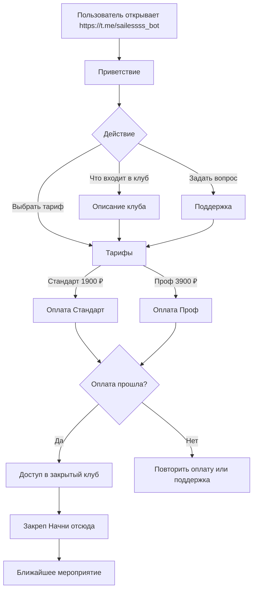

# ТЗ: оплата, доступы и аналитика PokerHUB Club

Дата: 2026-06-17
Обновлено: 2026-07-09
Статус: актуальное ТЗ для запуска через Tribute и дальнейшей автоматизации

Связанные документы:

- `01-produktovaya-koncepciya-zakrytogo-kluba.md`
- `03-voronka-oplaty-i-dostupa-pokerhub-club.md`
- `05-todo-zapusk-kluba-posle-intensiva.md`
- `06-scenarii-kommunikacii-i-ton-kluba.md`

## 1. Problem Statement

Нужно продавать доступ в закрытый Telegram-клуб PokerHUB Club и выдавать доступ без ручного хаоса.

Пользователь должен:

1. открыть бот оплаты;
2. понять, что входит в клуб;
3. выбрать тариф;
4. оплатить;
5. получить доступ в закрытый клуб;
6. увидеть первый шаг внутри клуба.

Команда должна видеть:

- кто открыл бота;
- какие кнопки нажимал;
- какой тариф смотрел;
- какой тариф выбрал;
- оплатил ли;
- получил ли доступ;
- где человек отвалился.

## 2. Input

### Продукт

PokerHUB Club - закрытое образовательное сообщество по покеру в Telegram.

### Основная ссылка оплаты

https://t.me/sailessss_bot

### Тарифы

| Тариф | Цена запуска | Регулярная цена | Доступ |
|---|---:|---:|---|
| Стандарт | 1900 ₽ | 2490 ₽ | Основной клуб: материалы, live, разборы, чат, Loqer, чарты, сетки, челленджи и фриролл |
| Проф | 3900 ₽ | 4900 ₽ | Все из Стандарта, тренажер, 2 отдельные live-встречи, приоритет саппорта и разборов |

### Что входит в Стандарт

- Spin Middle.
- MTT, третий модуль.
- База видео по всем дисциплинам.
- 4 live-тренировки в месяц.
- 4 текстовых разбора раздач в месяц.
- Ответы от Академика и Олега в чатах.
- Loqer: доступ к софту и поддержка от создателя.
- Чарты на просмотр: ГТО-чарты и базовые из курсов.
- MTT-сетки до low ABI, возможно не все румы на старте.
- Комьюнити: общий чат, вопросы и ответы.
- Челленджи в тренажере.
- 1 фриролл в месяц от Академика.

### Что добавляет Проф

- Доступ к тренажеру.
- 2 отдельные live-встречи для Проф-тарифа.
- Приоритет саппорта и разбора раздач.

### Платежный контур

Основной стартовый контур: Tribute.

CloudPayments остается запасным или следующим контуром, если потребуется отдельная платежная страница, рекурренты по РФ-картам, СБП, фискализация или более гибкая интеграция.

## 3. Output

Должно быть готово рабочее решение:

- бот оплаты открывается по ссылке;
- в боте есть нормальное приветствие;
- пользователь видит, что входит в клуб;
- пользователь выбирает Стандарт или Проф;
- пользователь оплачивает;
- после оплаты получает доступ в закрытый клуб;
- если доступ не выдался, создается понятный ручной сценарий поддержки;
- команда видит аналитику по кнопкам и оплатам;
- в клубе есть закреп `Начни отсюда`.

## 4. Outcome

После выполнения задачи клуб можно продавать без постоянных ручных объяснений.

Снимаются риски:

- человек открыл бот и не понял, куда попал;
- человек оплатил, но не получил доступ;
- саппорт не знает, что писать;
- команда не видит, где люди отваливаются;
- тарифы объясняются по-разному в разных местах.

## 5. Пользовательский flow

## 6. Тексты, которые должны быть в боте

Финальные тексты находятся в `06-scenarii-kommunikacii-i-ton-kluba.md`.

В боте обязательно нужны:

- приветствие;
- описание клуба;
- описание Стандарта;
- описание Профа;
- сообщение после успешной оплаты;
- сообщение, если оплата не прошла;
- сообщение, если оплата прошла, но доступ не выдался;
- кнопка поддержки.

## 7. Аналитика

Минимально нужно логировать события:

| Событие | Зачем |
|---|---|
| `bot_opened` | сколько людей открыло бот |
| `club_info_opened` | сколько изучило состав клуба |
| `tariffs_opened` | сколько дошло до тарифов |
| `standard_opened` | сколько смотрело Стандарт |
| `pro_opened` | сколько смотрело Проф |
| `standard_payment_clicked` | сколько нажало оплату Стандарта |
| `pro_payment_clicked` | сколько нажало оплату Профа |
| `standard_paid` | сколько оплатило Стандарт |
| `pro_paid` | сколько оплатило Проф |
| `access_granted` | сколько получило доступ |
| `access_failed` | сколько оплатило, но доступ не выдался |
| `support_clicked` | сколько ушло в поддержку |

Если Tribute не дает часть событий, нужно явно отметить, какие события недоступны без API, и предложить обходной способ учета.

## 8. Контроль оплат и доступов

### Через Tribute

Нужно проверить:

- виден ли Telegram пользователя;
- виден ли выбранный тариф;
- видна ли сумма оплаты;
- видна ли дата оплаты;
- виден ли срок доступа;
- виден ли статус подписки;
- можно ли выгрузить оплативших;
- как Tribute снимает доступ после отмены или неоплаты;
- что происходит, если оплата прошла, а доступ не выдался.

### Ручной fallback

Если доступ не выдался автоматически:

1. Пользователь пишет в поддержку.
2. Поддержка просит Telegram и тариф.
3. Ответственный проверяет оплату в Tribute.
4. Ответственный вручную выдает доступ.
5. Кейс помечается как закрытый.

Минимальные поля журнала проблемных кейсов:

- Telegram;
- тариф;
- дата оплаты;
- проблема;
- кто отвечает;
- статус решения;
- комментарий.

## 9. CloudPayments как запасной контур

CloudPayments не является главным flow запуска, но остается планом Б.

Использовать CloudPayments, если:

- Tribute не даст нужную аналитику;
- Tribute не позволит нормально управлять доступами;
- потребуется отдельная платежная страница;
- потребуется СБП / РФ-карты / фискализация через ИП;
- потребуется другой сценарий для рекуррентных платежей.

Из переписки с менеджером:

- стартовая комиссия по картам РФ - 3.9%;
- СБП - 1.7%;
- рекуррентные платежи доступны по РФ-картам, СБП и pay-методам;
- иностранные карты подключаются только после оборота от 100 000 рублей в месяц по РФ-картам;
- по иностранным картам нет рекуррентных платежей;
- по иностранным картам ставка 12%;
- API/webhooks есть;
- фискализация нужна по 54-ФЗ.

## 10. Telegram-инфраструктура

После оплаты пользователь должен попасть в закрытый клуб, где есть:

- главный канал клуба;
- общий чат;
- топики по направлениям;
- место для расписания;
- место для записей;
- закреп `Начни отсюда`;
- контакт поддержки.

Права доступа:

| Зона | Стандарт | Проф |
|---|---|---|
| Главный канал | да | да |
| Общий чат | да | да |
| Топики по направлениям | да | да |
| База видео | да | да |
| Loqer | да | да |
| Чарты | да | да |
| MTT-сетки до low ABI | да | да |
| Тренажер | нет | да |
| Отдельные live для Профа | нет | да |
| Приоритет саппорта/разборов | нет | да |

## 11. Acceptance Criteria

- [ ] Бот открывается по ссылке https://t.me/sailessss_bot
- [ ] В боте есть приветствие.
- [ ] В боте есть кнопка `Что входит в клуб`.
- [ ] В боте есть кнопка `Выбрать тариф`.
- [ ] В боте есть кнопка `Задать вопрос`.
- [ ] Есть тариф Стандарт за 1900 ₽.
- [ ] Есть тариф Проф за 3900 ₽.
- [ ] В описании тарифов написано, что будет после оплаты.
- [ ] Тестовая оплата Стандарта проходит.
- [ ] Тестовая оплата Профа проходит.
- [ ] После оплаты доступ выдается.
- [ ] Если доступ не выдался, есть ручной fallback.
- [ ] Есть аналитика по ключевым кнопкам или список ограничений Tribute без API.
- [ ] В клубе есть закреп `Начни отсюда`.
- [ ] У саппорта есть готовые сообщения из `06-scenarii-kommunikacii-i-ton-kluba.md`.

## 12. Открытые вопросы

- Какие события Tribute реально отдаёт без API?
- Можно ли отдельно видеть просмотры Стандарта и Профа?
- Можно ли понять, что человек нажал оплату, но не оплатил?
- Кто будет владельцем журнала проблемных оплат?
- Кто обновляет описание тарифов в Tribute при переходе с цен запуска на регулярные цены?
- Когда включаем CloudPayments как запасной контур?
