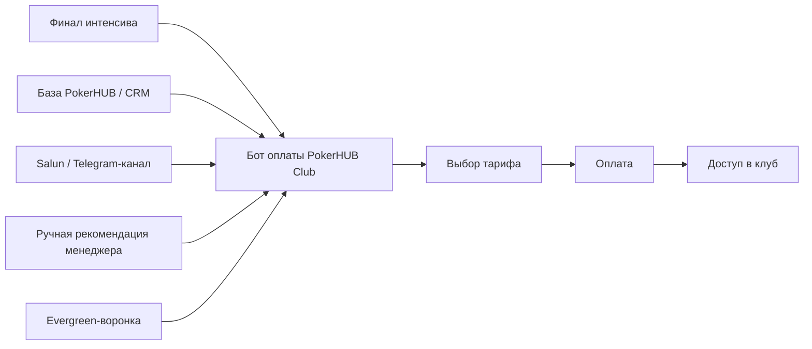
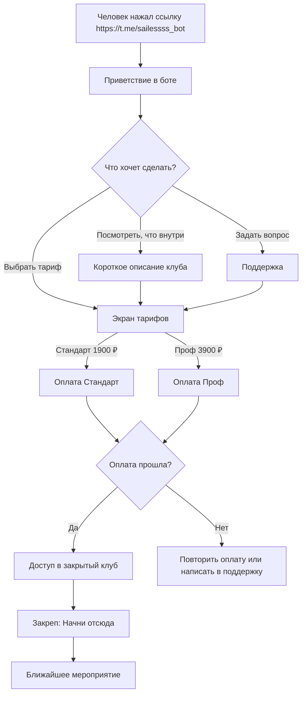
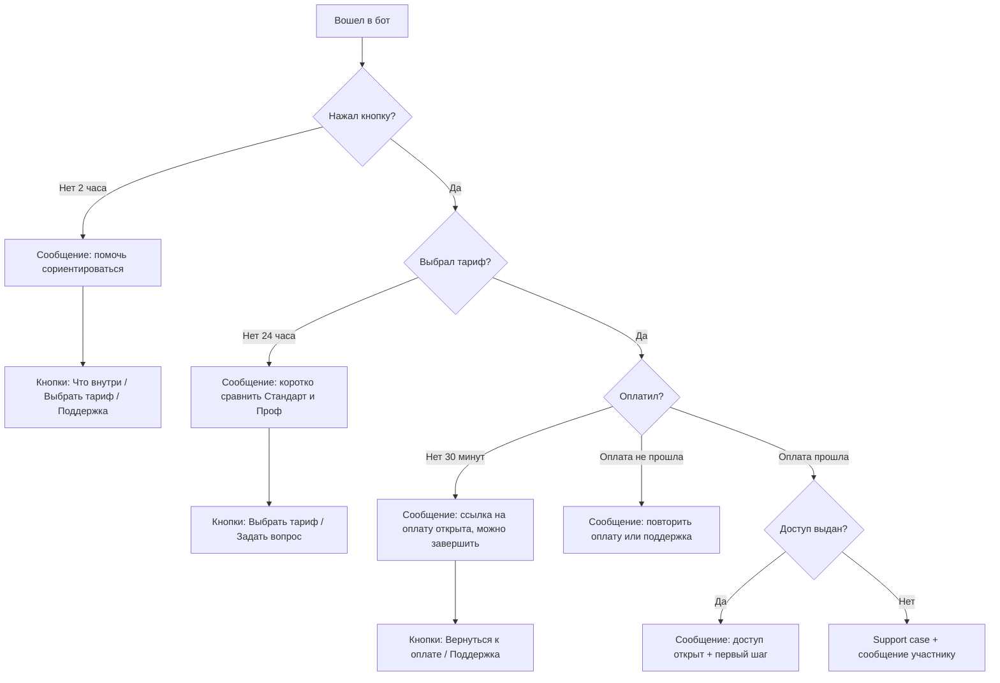

# Воронка оплаты и доступа PokerHUB Club

Дата: 2026-06-17
Обновлено: 2026-07-09
Статус: актуальная схема оплаты, доступа и сообщений для запуска клуба

Связанные документы:

- `01-produktovaya-koncepciya-zakrytogo-kluba.md`
- `02-TZ-telegram-subscription-flow.md`
- `05-todo-zapusk-kluba-posle-intensiva.md`
- `06-scenarii-kommunikacii-i-ton-kluba.md`

## 1. Что изменилось по итогам недели

По выгрузке Telegram с Сашей за 6-9 июля зафиксировано:

- Tribute протестирован, доступ в клуб выдается.
- Основная ссылка на оплату для пользователя: https://t.me/sailessss_bot
- Тариф `Стандарт`: 1900 ₽ на запуске, регулярная цена 2490 ₽.
- Тариф `Проф`: 3900 ₽ на запуске, регулярная цена 4900 ₽.
- Нужно считать аналитику по кнопкам: кто открыл бота, кто смотрел тарифы, кто смотрел Проф, кто дошел до оплаты и где отвалился.
- Из-за текущего запуска через Tribute без API часть напоминаний может быть недоступна. Поэтому в документе разделены стартовый flow и целевой flow после API.

## 2. Главная логика

Клуб продается как следующий шаг после интенсива и как отдельный продукт для базы PokerHUB.

Пользовательский путь должен быть коротким:

1. Человек получает ссылку на оплату.
2. Открывает бот PokerHUB Club.
3. Понимает, куда попал и что будет после оплаты.
4. Выбирает тариф.
5. Оплачивает.
6. Получает доступ в закрытый клуб.
7. Видит закреп `Начни отсюда`.
8. Понимает первый шаг и ближайшее мероприятие.

## 3. Точки входа

Главное правило: сообщение в точке входа должно совпадать с тем, что человек видит в боте. Если в креативе или эфире обещали клуб с тренировками, разборами, софтом и поддержкой, бот должен начинаться с этого же смысла.

## 4. Быстрый flow запуска через Tribute

Критерий готовности быстрого flow: тестовый пользователь без голосовых объяснений может открыть бота, выбрать тариф, оплатить, попасть в клуб и понять первый шаг.

## 5. Тарифы в боте

| Тариф | Цена запуска | Регулярная цена | Кому подходит | Что пишем коротко |
|---|---:|---:|---|---|
| Стандарт | 1900 ₽ | 2490 ₽ | Хочет зайти в клуб, получить материалы, тренировки, разборы, чаты и софт | Курсы, 4 live, 4 текстовых разбора, Loqer, чарты, сетки, чат, челленджи и фриролл |
| Проф | 3900 ₽ | 4900 ₽ | Хочет больше практики и быстрее получать внимание команды | Все из Стандарта, тренажер, 2 отдельные live-встречи, приоритет саппорта и разборов |

## 6. Приветствие в боте

Задача приветствия: человек должен сразу понять, куда попал, что здесь можно сделать и что будет после оплаты.

Текст:

> Привет! Это бот PokerHUB Club.
>
> Здесь можно выбрать тариф, оплатить доступ и попасть в закрытый клуб.
>
> В клубе ты получишь курсы, live-тренировки, разборы раздач, чаты, Loqer, чарты, MTT-сетки и задания. Это нужно, чтобы после интенсива не остаться одному и продолжить движение в покере с понятным следующим шагом.
>
> Что хочешь посмотреть?

Кнопки:

- `Что входит в клуб`
- `Выбрать тариф`
- `Задать вопрос`

## 7. Экран "Что входит в клуб"

Текст:

> В Стандарте за 1900 ₽ на запуске:
>
> • Spin Middle и 3-й модуль MTT
> • база видео по всем дисциплинам
> • 4 live-тренировки в месяц
> • 4 текстовых разбора раздач в месяц
> • ответы Академика и Олега в чатах
> • Loqer, чарты, MTT-сетки до low ABI
> • общий чат, челленджи и фриролл
>
> В Проф за 3900 ₽:
> все из Стандарта, тренажер, 2 отдельные live-встречи для Профа и приоритет по саппорту и разборам.

Кнопки:

- `Выбрать тариф`
- `Задать вопрос`
- `Назад`

## 8. Экран тарифов

Текст:

> Выбери тариф.
>
> Если хочешь зайти в клуб, получить материалы, live-тренировки, разборы и чаты, бери Стандарт.
>
> Если хочешь больше практики и быстрее получать внимание команды, бери Проф.

Кнопки:

- `Оплатить Стандарт за 1900 ₽`
- `Оплатить Проф за 3900 ₽`
- `Что входит в тарифы`
- `Задать вопрос`

## 9. Что человек должен увидеть после оплаты

Текст:

> Оплата прошла, доступ открыт.
>
> Начни отсюда:
>
> 1. Зайди в общий чат.
> 2. Открой закреп `Начни отсюда`.
> 3. Выбери дисциплину или напиши, где ты сейчас: новичок, Spin, MTT или Cash.
> 4. Посмотри ближайшую live-встречу в расписании.
>
> Если потеряешься, напиши в поддержку. Поможем найти первый шаг.

Кнопки:

- `Войти в клуб`
- `Открыть расписание`
- `Написать в поддержку`

## 10. Если оплатил, но доступа нет

Текст:

> Оплата есть, а доступ не появился?
>
> Напиши сюда свой Telegram и тариф. Проверим оплату и откроем доступ вручную.

Кнопки:

- `Написать в поддержку`
- `Вернуться в меню`

## 11. Если оплата не прошла

Текст:

> Оплата не прошла.
>
> Обычно это значит, что банк отклонил платеж или страница оплаты закрылась раньше времени. Попробуй еще раз. Если снова не получится, напиши в поддержку, поможем.

Кнопки:

- `Повторить оплату`
- `Написать в поддержку`

## 12. Recovery-flow после API

Сейчас Tribute может не дать отправлять все напоминания до оплаты. Но целевой flow после API должен уметь возвращать людей, которые зависли на шаге.

## 13. Матрица сообщений по состояниям

| Состояние | Когда пишем | Сообщение | Кнопки |
|---|---|---|---|
| Вошел в бот и ничего не нажал | Через 2 часа, если доступно технически | Привет! Видел, что ты открыл клуб, но не выбрал следующий шаг. Можно сначала посмотреть, что внутри, или сразу выбрать тариф. | `Что внутри`, `Выбрать тариф`, `Поддержка` |
| Посмотрел описание, не выбрал тариф | Через 24 часа, если доступно технически | Если коротко: Стандарт подойдет, чтобы зайти в клуб, получить материалы, live, разборы и чаты. Проф нужен, если хочешь больше практики и приоритет по вопросам. | `Выбрать тариф`, `Задать вопрос` |
| Выбрал тариф, не оплатил | Через 30 минут, если доступно технически | Ты выбрал тариф, но оплата не завершилась. Ссылка еще актуальна. Если что-то не открылось или банк отклонил оплату, напиши сюда, поможем. | `Вернуться к оплате`, `Поддержка` |
| Оплата не прошла | Сразу | Оплата не прошла. Попробуй еще раз или напиши в поддержку, если платеж снова отклонится. | `Повторить оплату`, `Поддержка` |
| Оплатил, доступ выдан | Сразу | Оплата прошла, доступ открыт. Зайди в клуб и открой закреп `Начни отсюда`. | `Войти в клуб`, `Открыть расписание` |
| Оплатил, доступа нет | Сразу после ошибки | Оплату видим. Доступ сейчас проверим и откроем вручную. Напиши сюда Telegram и тариф, чтобы не потерять заявку. | `Написать в поддержку` |
| Зашел в клуб, но не активировался | Через 24 часа после входа | Привет! Чтобы не потеряться, начни с закрепа `Начни отсюда`: там расписание, курсы, чаты и первый шаг. Если не знаешь, с чего начать, напиши в общий чат. | `Открыть закреп`, `Открыть расписание` |
| Скоро продление | За 3 дня и за 1 день, если включено автопродление | Скоро продлится доступ к клубу. Если хочешь продолжить, ничего делать не нужно. Если хочешь отменить подписку, это можно сделать в меню оплаты. | `Управлять подпиской` |
| Продление не прошло | Сразу после неуспешного списания | Продление не прошло. Доступ может закрыться, если платеж не восстановить. Попробуй оплатить еще раз или напиши в поддержку. | `Восстановить доступ`, `Поддержка` |

## 14. Что считаем в аналитике

Минимум для запуска:

- открыл бота;
- нажал `Что входит в клуб`;
- нажал `Выбрать тариф`;
- открыл `Стандарт`;
- открыл `Проф`;
- нажал оплату `Стандарт`;
- нажал оплату `Проф`;
- оплатил;
- получил доступ;
- перешел в клуб;
- открыл закреп или расписание, если это можно отследить.

Зачем это нужно: если люди массово смотрят Проф, но не покупают, значит нужно менять упаковку, цену или объяснение отличий. Если открывают оплату и не платят, проблема может быть в платежном шаге или доверии.

## 15. Тон сообщений

Говорим как нормальный менеджер клуба:

- здороваемся;
- пишем коротко;
- объясняем, что будет после действия;
- не давим и не пугаем;
- не обещаем быстрый заработок;
- не используем канцелярит и фразы вроде "в рамках", "уникальная возможность", "закрыть боли";
- если человек потерялся, помогаем, а не обвиняем.

## 16. Что передаем разработчику и команде

- Ссылку на бот оплаты: https://t.me/sailessss_bot
- Тарифы: Стандарт 1900 ₽ / регулярный 2490 ₽, Проф 3900 ₽ / регулярный 4900 ₽.
- Тексты приветствия, описания тарифов и сообщений после оплаты.
- Список событий для аналитики.
- Сценарий ручной поддержки, если оплата прошла, а доступ не выдался.
- Закреп `Начни отсюда` и ссылку на ближайшее мероприятие клуба.
